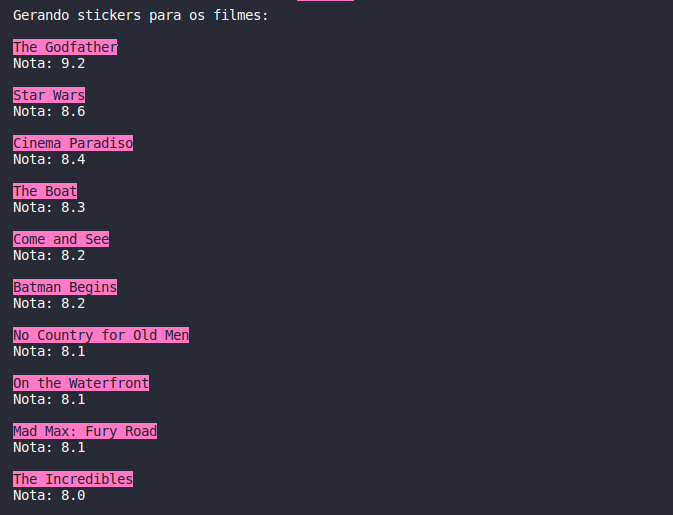

<h1 align="center">

 Sticker Factory 

</h1>

Projeto desenvolvido durante a imersão Java da <a href="https://www.alura.com.br/"> alura </a>.Trata-se de um programa que consome um webservice semelhante a API top 250 filmes da IMDB e gera stickers para o whatsapp com base na sua avaliação.

<h2>Funcioamento e desing do projeto</h2>

O projeto foi modelado a partir de um conceito de fábrica, sendo a classe ProductionCenter do pacote factory que executa o método main(). Ou seja, é centro de produção da fábrica que os recursos são utilizados para gerar as figurinhas.

A primeira coisa a ser realizada no método main() é o acesso a API com os top filmes da IMDB por meio do método estático getContent() da classe MyHttpClient. Esse método retorna um conteúdo json no formato de string.

Posteriormente, esse json é parseado e os dados dos filmes são extraídos por meio de um extrator.  são utilizados para instanciar ImdbMovies em uma lista de Content. Desta forma, percebe-se que ImdbMovies é uma classe filha de Content.

Content é uma classe abstrata do pacote entertaimentContent. Essa classe foi criada com o intuíto de modelar o programa para consumir endpoints que tivessem três características em comum: poster, título e avaliação. Permitindo gerar figurinhas a partir de outros webservices, contanto que tenham essas informações.

Devido a isso, foi importante criar uma interface Extractot com o método data(), que extraí as informações do json. As classes que implementarem essa interface definirão como os dados vão ser extraídos, podendo ter extrator dos dados do endpoint do IMDB, Marvel, Stars Wars, etc.

Após a instanciação dos ImdbMovies na lista de Content, o método estático producer(), da classe StickerGenerator, produz as figurinhas com base na nota, utilizando dessa para inserir as estrelas. Depois de criar os stickers na pasta /output, o programa imprime no terminal o título do filme que acabou de gerar o sitcker e a sua nota do IMDB com 1 casa decimal.

<!--- <h2> Como gerar figurinhas? </h2>

Para gerar 

<h2>Tecnologias utilizadas</h2> -->